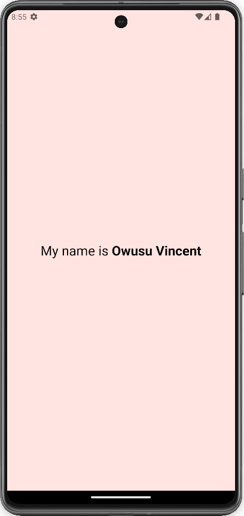

# rn-assignment2-11100931
React Native - My Introduction App
This is a simple React Native application that displays a text greeting.

## Features
Displays the text "My name is Owusu Vincent" with "Owusu Vincent" in bold font.
Running the App
## Prerequisites:
Node.js and npm (or yarn) installed on your system.
Steps:

## Clone this repository.
Navigate to the project directory in your terminal.
Install dependencies:
Bash
npm install
Use code with caution.
content_copy
Run the app on an Android device or emulator:
Bash
npx react-native run-android
Use code with caution.
content_copy
Run the app on an iOS device or simulator:
Bash
npx react-native run-ios
Use code with caution.
content_copy
Code Breakdown
The code consists of three main parts:

## Imports:

StatusBar and other components are imported from expo-status-bar and react-native.
App component:

This is the main component of the app. It returns a View container with the following elements:
A Text component displaying "My name is ".
Another nested Text component displaying "Owusu Vincent" in bold font achieved using inline styles.
A StatusBar component to display the status bar at the top of the screen.
Styles:

Two style sheets are created using StyleSheet.create:
styles: Defines styles for the container view (flex, backgroundColor, alignItems, and justifyContent).
textFont: Defines styles for the text (fontSize). You can uncomment fontWeight and color properties to set the font weight and color.
 
## Screenshots

